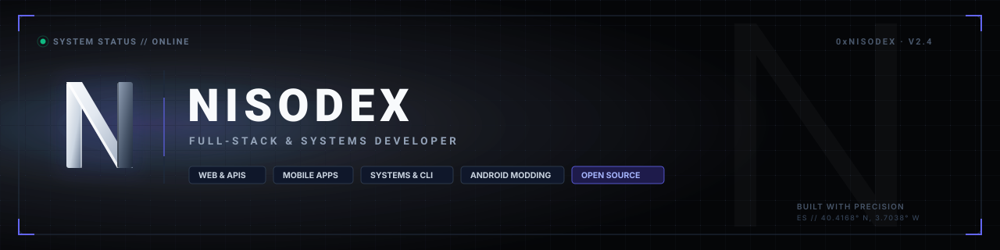
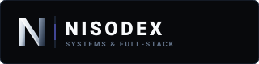

  

 

  
  &nbsp;
  
  &nbsp;
  

 

### Full-Stack & Systems Developer

Crafting high-performance web & mobile applications, low-level tooling, and system customizations across the **Open Source** ecosystem.

*Clean code over clever code &middot; Performance by design &middot; Ship fast, build right, keep it open*

---

## 🛠 Tech Stack

### Core Languages

### Frontend & Mobile

### Backend & Storage

### DevOps & Environment

---

## 📊 GitHub Analytics

  
  &nbsp;
  

---

## 🚀 Featured Projects

| Project | Tech Stack | Description |
| :--- | :---: | :--- |
| [**force-tabs-popup-blocker**](https://github.com/nisodex/force-tabs-popup-blocker) | `JavaScript` `Extension` | Browser extension designed to intercept and prevent aggressive tab redirection and unwanted popups. |
| [**klipper-paste-on-select**](https://github.com/nisodex/klipper-paste-on-select) | `C++` `KDE` | Lightweight clipboard integration for KDE Plasma to automate paste on selection behavior. |
| [**kwin-custom-resolution**](https://github.com/nisodex/kwin-custom-resolution) | `Shell` `KWin` | Custom display resolution scripts and mode management for KWin on Linux. |
| [**HeadsetControl**](https://github.com/nisodex/HeadsetControl) | `C++` `Linux` | Sidetone and battery status utility for gaming headsets under Linux & macOS. |
| [**arch-aur-android-studio**](https://github.com/nisodex/arch-aur-android-studio) | `Shell` `Arch AUR` | Automated packaging recipes and PKGBUILD for Android Studio on Arch Linux. |

---

  
   
  <b>NISODEX</b> &copy; 2026 &middot; Built with precision &middot; <a href="https://github.com/nisodex"><code>github.com/nisodex</code></a>

